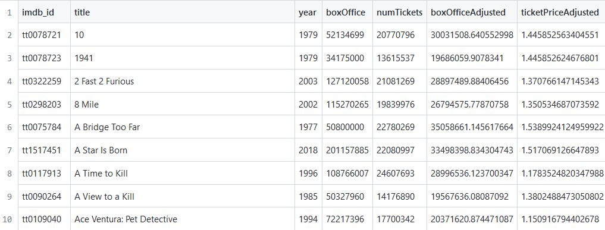
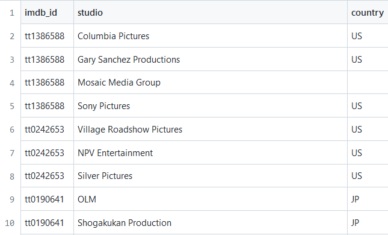
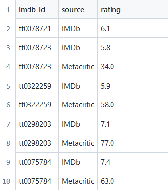

# Projeto SQLflix

# Equipe `Time BDV` - `BDV`

-   `Daniel Credico de Coimbra` - `155077`
-   `Gabriel Bonfim Silva de Moraes` - `216111`
-   `Victor Durço Gomes Bijos` - `206508`

## Resumo do Projeto

Dataset relacional que integra informações de diversas fontes sobre os 25 filmes com maior bilheteria de cada um dos últimos 50 anos (1972-2021), totalizando um escopo inicial de 1250 filmes. Cada filme está associado a características como código IMDb, ano, avaliação crítica (IMDb e Metacritic), e bilheteria em solo americano corrigida por inflação. Ademais, o dataset possui tabelas relacionando filmes a seus gêneros e aos estúdios que os produziram. Como as perguntas de análise indicarão, o objetivo do dataset é permitir tanto maior compreensão do fenômeno cultural do cinema quanto melhor tomada de decisões sobre a produção de filmes.

## Slides da Apresentação

[Link da apresentação (Google Slides)](slides/final_slides.pdf)

## Modelo Conceitual Preliminar


## Modelos Lógicos Preliminares

### Modelo relacional: quatro tabelas

```
FILMS: (imdb_id, title, imdb_rating, metacritic_rating, year, boxOffice, numTickets, boxOfficeAdjusted, ticketPriceAdjusted)
REVIEWS: (imdb_id, source, rating)
STUDIOS: (imdb_id, studio, country)
GENRES: (imdb_id, genre)
```

### Modelo hierárquico: coleção de objetos "filme"

```
{
  imdb_id,
  title,
  year,
  boxOffice,
  numTickets,
  boxOfficeAdjusted,
  ticketPriceAdjusted,
  reviews: {
    source,
    rating
  },
  studios: {
    studio,
    country
  },
  genres: {
    genre
  }
}
```

### Modelo de grafo

```
Nódulo: film (imdb_id: int, title: str, year: int, boxOffice: int, numTickets: int, boxOfficeAdjusted: float, ticketsPriceAdjusted: float)
Nódulo: review (source: str, rating: float).
Nódulo: studio (studio: str, country: str).
Nódulo: genre (genre: str).
Relação: has (review × film).
Relação: belongs (studio × film).
Relação: belongs (genre × film).
```

## Dataset

| título do arquivo/base | link                                                  | breve descrição                                                                                                                                                                                          |
| ---------------------- | ----------------------------------------------------- | -------------------------------------------------------------------------------------------------------------------------------------------------------------------------------------------------------- |
| `FILMS`  | [FILMS](data/processed/films_table.csv) | `Tabela contendo uma linha para cada filme em nosso recorte, informando: código IMDb do filme, título, ano, bilheteria, número de ingressos vendidos, box office em solo americano ajustado por inflação do dolar, e preço do ingresso ajustado pela inflação.` |
| `STUDIOS`  | [STUDIOS](data/processed/studios_table.csv) | `Tabela contendo uma linha para cada estúdio que participou da produção de um filme em nosso recorte, informando: código IMDb do filme, nome do estúdio, e país do estúdio.` |
| `REVIEWS`  | [REVIEWS](data/processed/reviews_table.csv) | `Tabela contendo uma linha para cada resenha, dentre avaliações IMDb e Metacritic (mas isso é expansível no futuro), de cada filme em nosso recorte, informando: código IMDb do filme, fonte da resenha, e nota não-normalizada.` |
| `GENRES`  | [GENRES](data/processed/genres_table.csv) | `Tabela contendo uma linha para cada gênero de cada filme em nosso recorte, informando: código IMDb do filme e o nome do gênero.` |








## Bases de Dados

| título da base       | link                                          | breve descrição                                                                                              |
| -------------------- | --------------------------------------------- | ------------------------------------------------------------------------------------------------------------ |
| `The Movie Database` | `https://www.themoviedb.org/ (API)` | `O Movie Database (TMDB) é um banco de dados popular e editável pelo usuário para filmes e programas de TV.` |
| `IMDB Database` | `https://datasets.imdbws.com/ (API)` | `API oficial do IMDB (com grandes restrições de uso)` |
| `Metacritic (site)` | `https://www.metacritic.com/ (Web scraping)` | `Popular site para reviews de jogos, filmes e séries` |
| `The Numbers (site)` | `https://www.the-numbers.com/ (Web scraping)` | `Site com útil serviço de dados financeiros sobre filmes.` |
| `Macro Trends (site)` | `https://www.macrotrends.net/countries/USA/united-states/inflation-rate-cpi` | `Taxa de inflação anual dos EUA.` |

## Detalhamento do Projeto

Nesta seção, detalharemos nosso projeto duas etapas. Na primeira etapa, detalharemos nossos esforços nas duas formas principais foram utilizadas para coletar dados para o projeto: *webscraping* e acesso de *API*. Na segunda etapa, explicaremos como transformamos esses dados com scripts Python e SQL para obter nossas tabelas finais. Todos os programas para coleta e tratamento de dados podem ser encontrados [aqui](src), enquanto os *datasets* finais estão [neste diretório](data/processed).

### Webscrapings
Criamos e executamos dois scripts de *webscraping*, ambos escritos em Python e utilizando as bibliotecas *requests* e *BeautifulSoup*. A primeira biblioteca envia um HTTP GET request para uma URL escolhida à mão do *website* desejado, enquanto a segunda biblioteca analisa o HTML retornado para encontrar alguma informação desejada. Por vezes, essa informação se trata de outra URL do mesmo *website*, e neste caso a biblioteca *requests* é usada novamente com esta nova URL.

#### The Numbers (Webscraping 1)
[Neste script](src/get_thenumbers.py), foi utilizado uma estratégia de rotacionar entre os diversos sites para descobrir a lista de filmes dos últimos cinquenta anos, junto com suas respectivas informações de bilheteria e número de ingressos.

~~~ python
year = 2021
# Essas próximas três linhas são utilizadas para armazenar o conteúdo html de um site em um elemento 'soup' 
url_list = "https://www.the-numbers.com/market/" + str(year) + "/top-grossing-movies"
response_list = requests.get(url_list)
soup = BeautifulSoup(response_list.content, "html.parser")
~~~~
Através do elemento gerado por *soup*, adquirimos toda a informação necessária e depois fazemos um loop diminuindo o valor: 
~~~ python 
for i in range(50) 
    year = 2021 - i
    get_data()
~~~
Onde *get_data()* pode ser substituida pelos elementos que se deseja obter do html. Foi necessário um segundo degrau de webscraping para coletar o nome dos filmes, isso aconteceu devido à alguns erros com relação a filmes de nomes muito grandes com reticências no final. Os nomes acabavam ficando na forma de "Missão Impossível: A ..."

Então, bastou uma outra váriavel para armazenar o url de um site com o efetivo nome completo do filme.
~~~ python
# A string str(j['href']) possui o formato "movie/nome-do-filme#tab=box-office"
url_movie = "https://www.the-numbers.com" + str(j['href'])
response_movie = requests.get(url_movie)
soup_movie = BeautifulSoup(response_movie.content, "html.parser")
# Encontrar o nome do filme e transformar em text:
movie_name = soup_movie.find("h1")
movie_name = movie_name.text[0: len(movie_name) - 7]
~~~

Perfeito, agora é fácil escrever todas as informações coletadas em um arquivo csv.

~~~python
# Abrir um arquivo novo e armazenar o objeto csv.writer
file = open("list.csv", "a", newline="", encoding="utf-8")
writer = csv.writer(file)
(...)
# Usamos a função tuple_add para adicionar todas as informações coletadas na variável tupla e escrever essa váriavel no arquivo
tupla = tuple_add(tupla, year, movie_name, budget, number_tickets)
writer.writerow(tupla)
(...)
# Enfim, fechar o arquivo
file.close()
~~~

#### Metacritic (Webscraping 2)
Criamos uma função que recebe o nome de um filme, busca por ele na seção de filmes do *website* do Metacritic, e devolve a avaliação do primeiro resultado. O nome dos 1250 filmes que estão no escopo de nosso trabalho foram obtidos por meio do *webscraping* do *website* The Numbers, conforme detalhado na sub-seçao anterior. Notamos que algumas dúzias de filmes não retornaram nenhum valor de avaliação, seja pela variabilidade do *website* (que teria despistado nosso algoritmo), seja por realmenten ão ter avaliação na plataforma. Destacamos uma complexidade do *webscraping*: como pode-se ver no trecho de código abaixo, precisamos simular com o argumento "headers" uma HTTP GET request realizada por um browser.

~~~python
def get_metascore(movie_name):
	headers = {'User-Agent': 'Mozilla/5.0 (Macintosh; Intel Mac OS X 10_11_5) AppleWebKit/537.36 (KHTML, like Gecko) Chrome/50.0.2661.102 Safari/537.36'}
	url = f"https://www.metacritic.com/search/movie/{movie_name}/results"
  response = requests.get(url, headers=headers)
	binary = response.content
	searchpage = BeautifulSoup(binary, "html.parser")
	movie = searchpage.find(class_ = "result first_result")
  #(...)
~~~

### APIs
*falta escrever intro*

####  TMDb Checker (API 1)
*falta escrever o TMDB Checker*

#### IMDb (API 2)
*falta escrever o IMDb*

### Tratamento de dados
*falta escrever intro*

#### JOINs em SQL (Tratamento 1)
*falta escrever o SQL Joins*

#### Correção pela Inflação (Tratamento 2)
*falta revisar*

Para o ajuste da inflação, encontramos um site que contenha alguns dados para nos ajudar no cálculo: https://www.macrotrends.net/countries/USA/united-states/inflation-rate-cpi

Utilizamos o ano de 1972 como refêrencia e obtemos a inflação acumulada para os próximos cinquenta anos. Com cada um desses valores prontos, podemos dividir o *box-office* do ano pela inflação acumulada e descobrir o valor em comparação ao ano de 1972.


## Evolução do Projeto

De início, o grupo realizou uma sessão de *brainstorm* para escolher a temática de nosso *dataset*. Consideremos ideias relacionadas à pandemia de COVID, à indústria de jogos, à segurança pública, e finalmente à indústria de filmes. O projeto SQLflix foi selecionado tanto por ser original em relação ao que esperávamos que outros grupos escolhessem, quanto por nos parecer inicialmente que haveria uma fartura de dados disponíveis online para nosso uso. A indústria cinematográfica é economicamente gigante e possui ampla penetração cultural no Ocidente, de modo que a relevância deste *dataset* ficou clara desde o início.

De início, ambicionávamos conectar informações sobre os filmes em si (tais como ano de produção e país de origem) com informações sobre sua bilheteria (isto é, a receita bruta em dólares gerada em solo americano), nos permitindo realizar análises do tipo (i) a evolução temporal da bilheteria média dos filmes considerados e (ii) a relação entre bilheteria e país de origem. Após a criação de um modelo conceitual preliminar e dessas possíveis questões de análise, foi realizada uma exposição ao professor da disciplina para obtermos orientação. Acrescentamos então informações sobre o número de ingressos vendidos, os gêneros associados a cada filme, resenhas produzidas sobre os filmes em diferentes fontes, e uma correção da bilheteria pela inflação do dólar.

Um ponto de destaque do aprendizado do grupo, cujos membros jamais haviam trabalho com *webscraping* e obtenção de dados via *API*, é que a obtenção de dados é mais difícil do que parece.

Primeiro, porque há uma série de percalços no *webscraping*. Para dar dois exemplos de problemas: (i) existem websites cuja formatação HTML é inconsistente, de modo que se torna difícil ou impossível automatizar o *webscraping* sem considerar inúmeros casos possíveis, e (ii) existem websites cuja formatação HTML é gerada dinamicamente por um código JavaScript rodado pelo *browser*, de modo que nossos scripts de *webscraping* acessavam as páginas e as encontravam incompletas, sem as informações de que precisávamos. Ambos os problemas aconteceram com o *website* do RottenTomatoes, famosa fonte de agregação de resenhas sobre filmes, de modo que tivemos de abandonar nossas pretensões de incluir dados dessa fonte.

Segundo, porque há um grande percalço que pode impedir o uso de uma *API*: boa parte das APIs requerem pedido de acesso, e muitos pedidos de acesso são negados a estudantes e outros usuários gratuitos. Isso aconteceu com nossas tentativas de acessar as APIs do RottenTomatoes e do IMDb. Sobre o último, conseguimos apenas utilizar uma API gratuita mas muitíssimo limitada e incompleta, disponível [aqui](https://datasets.imdbws.com/) e já mencionada anteriormente. Também vale mencionar que existem APIs sempre gratuitas, porém inerentemente incompletas, como foi o exemplo da API que utilizados do [TMDB](https://www.themoviedb.org/), também supracitada, que não continha informação sobre mais de 150 dos 1250 filmes que consideramos.

Em ambos os casos, utilizamos scripts em Python e em JavaScript para obter os dados, conforme detalhado na seção anterior; os scripts se localizam [aqui](src). Após a coleta e limpeza de dados, tínhamos em mãos arquivos TSV e CSV que foram inseridos como tabelas preliminares no *software* Microsoft SQL Server Management Studio (MS SSMS), na qual pudemos então realizar algumas operações adicionais, principalmente operações de JOIN para unificar muitas das tabelas que tínhamos e obter o *dataset* final FILMS disponível em formato CSV [neste diretório](data/processed). Os scripts SQL podem ser encontrados [aqui](src). A correção monetária (pela inflação) foi realizada com um algoritmo em Python, assim como foi a criação da tabelas subsidiárias GENRES, REVIEWS, e STUDIOS disponíveis [na mesma pasta](data/processed) de FILMS, e cujos scripts de criação podem ser escontrados [na mesma pasta](src) dos scripts SQL.


## Perguntas de Pesquisa/Análise Combinadas e Respectivas Análises

* Pergunta/Análise 1: Modelo de Grafos - Quais os estudios mais presentes na produção de filmes de alta bilheteria nos últimos 50 anos?

Através do modelo de grafos, podemos lidar com relacionamentos entre estúdios e filmes. Em específico, a relação (estúdio) -[:produz]-> filme pode nos mostrar a quantidade de filmes produzidos por um estúdio. Assim, podemos contar a quantidade de relações de produção em um nódulo (estúdio) e descobrir os estúdios mais presentes. Abaixo, apresentamos uma query em Cypher para obter essa resposta.

```
MATCH (a)-[:produz]->(b)
RETURN a, COLLECT(a) as productors
ORDER BY SIZE(productors) DESC LIMIT 10
```

* Pergunta/Análise 2: Modelo Hierárquico - Quais os filmes com produção de maior colaboração internacional?

Na construção de nosso dataset, cruzamos informações vindas da API do The Movie Database (TMDB), do qual obtemos arquivos JSON informando os estúdios que participaram na produção de cada filme, junto com o país de origem de cada estúdio. Dessa forma, será possível percorrer cada um de nossos objetos JSON (correspondentes cada um a um filme) e quantificar quais filmes possuem uma maior quantidade de países diferentes dentro de sua lista interna de estúdios de produção.

* Pergunta/Análise 3: Modelo Relacional - Qual a evolução temporal da quantidade de ingressos média dos filmes de maior sucesso ao longo dos anos?

Agrupando a tabela de filmes por ano, podemos contar a média da bilheteria nominal para cada ano. Ao ordenar a tabela pelo ano, obtém-se a série temporal da bilheteria nominal média. Abaixo, apresentamos uma query em SQL para obter essa série.

```
SELECT AVG(boxOffice), year
FROM movie_table
GROUP BY YEAR
ORDER BY year  DESC;
```
