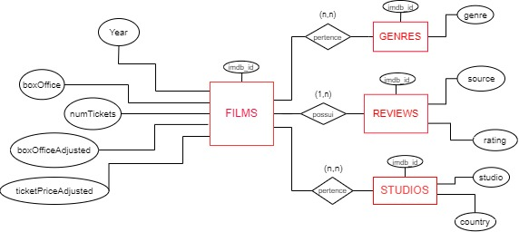
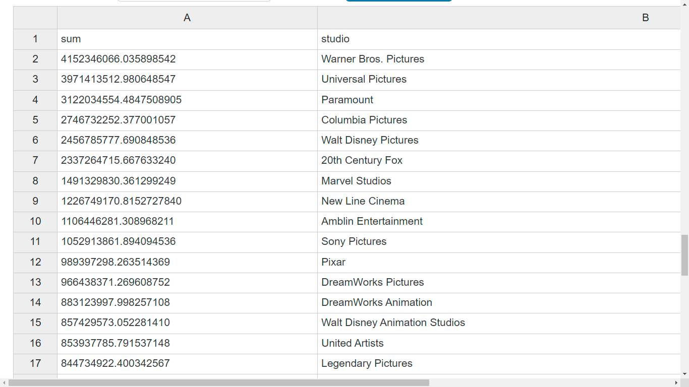

# Projeto SQLflix

# Equipe `Time BDV` - `BDV`

-   `Daniel Credico de Coimbra` - `155077`
-   `Gabriel Bonfim Silva de Moraes` - `216111`
-   `Victor Durço Gomes Bijos` - `206508`

## Resumo do Projeto

Dataset relacional que integra informações de diversas fontes sobre os 25 filmes com maior bilheteria de cada um dos últimos 50 anos (1972-2021), totalizando um escopo inicial de 1250 filmes. Cada filme está associado a características como código IMDb, ano, avaliação crítica (IMDb e Metacritic), e bilheteria em solo americano corrigida por inflação. Ademais, o dataset possui tabelas relacionando filmes a seus gêneros e aos estúdios que os produziram. Como as perguntas de análise indicarão, o objetivo do dataset é permitir tanto maior compreensão do fenômeno cultural do cinema quanto melhor tomada de decisões sobre a produção de filmes.

## Slides da Apresentação

[Link da apresentação (Google Slides)](slides/final_slides.pdf)

## Modelo Conceitual



## Modelos Lógicos Preliminares

### Modelo relacional: quatro tabelas

```
FILMS: (imdb_id, title, imdb_rating, metacritic_rating, year, boxOffice, numTickets, boxOfficeAdjusted, ticketPriceAdjusted)
REVIEWS: (imdb_id, source, rating)
STUDIOS: (imdb_id, studio, country)
GENRES: (imdb_id, genre)
```

### Modelo hierárquico: coleção de objetos "filme"

```
{
  imdb_id,
  title,
  year,
  boxOffice,
  numTickets,
  boxOfficeAdjusted,
  ticketPriceAdjusted,
  reviews: {
    source,
    rating
  },
  studios: {
    studio,
    country
  },
  genres: {
    genre
  }
}
```

### Modelo de grafo

```
Nódulo: film (imdb_id: int, title: str, year: int, boxOffice: int, numTickets: int, boxOfficeAdjusted: float, ticketsPriceAdjusted: float)
Nódulo: review (source: str, rating: float).
Nódulo: studio (studio: str, country: str).
Nódulo: genre (genre: str).
Relação: has (review × film).
Relação: belongs (studio × film).
Relação: belongs (genre × film).
```

## Dataset

| título do arquivo/base | link                                                  | breve descrição                                                                                                                                                                                          |
| ---------------------- | ----------------------------------------------------- | -------------------------------------------------------------------------------------------------------------------------------------------------------------------------------------------------------- |
| `FILMS`  | [FILMS](data/processed/films_table.csv) | `Tabela contendo uma linha para cada filme em nosso recorte, informando: código IMDb do filme, título, ano, bilheteria, número de ingressos vendidos, box office em solo americano ajustado por inflação do dolar, e preço do ingresso ajustado pela inflação.` |
| `STUDIOS`  | [STUDIOS](data/processed/studios_table.csv) | `Tabela contendo uma linha para cada estúdio que participou da produção de um filme em nosso recorte, informando: código IMDb do filme, nome do estúdio, e país do estúdio.` |
| `REVIEWS`  | [REVIEWS](data/processed/reviews_table.csv) | `Tabela contendo uma linha para cada resenha, dentre avaliações IMDb e Metacritic (mas isso é expansível no futuro), de cada filme em nosso recorte, informando: código IMDb do filme, fonte da resenha, e nota não-normalizada.` |
| `GENRES`  | [GENRES](data/processed/genres_table.csv) | `Tabela contendo uma linha para cada gênero de cada filme em nosso recorte, informando: código IMDb do filme e o nome do gênero.` |


## Bases de Dados

| título da base       | link                                          | breve descrição                                                                                              |
| -------------------- | --------------------------------------------- | ------------------------------------------------------------------------------------------------------------ |
| `The Movie Database` | `https://www.themoviedb.org/ (API)` | `O Movie Database (TMDB) é um banco de dados popular e editável pelo usuário para filmes e programas de TV.` |
| `IMDB Database` | `https://datasets.imdbws.com/ (API)` | `API oficial do IMDB (com grandes restrições de uso)` |
| `Metacritic (site)` | `https://www.metacritic.com/ (Web scraping)` | `Popular site para reviews de jogos, filmes e séries` |
| `The Numbers (site)` | `https://www.the-numbers.com/ (Web scraping)` | `Site com útil serviço de dados financeiros sobre filmes.` |
| `Macro Trends (site)` | `https://www.macrotrends.net/countries/USA/united-states/inflation-rate-cpi` | `Taxa de inflação anual dos EUA.` |

## Detalhamento do Projeto

Nesta seção, detalharemos nosso projeto duas etapas. Na primeira etapa, detalharemos nossos esforços nas duas formas principais foram utilizadas para coletar dados para o projeto: *webscraping* e acesso de *API*. Na segunda etapa, explicaremos como transformamos esses dados com scripts Python e SQL para obter nossas tabelas finais. Todos os programas para coleta e tratamento de dados podem ser encontrados [aqui](src), enquanto os *datasets* finais estão [neste diretório](data/processed). Mais detalhes sobre *webscraping* constam na seção "Evolução do Projeto" do presente documento.

### Webscrapings
Criamos e executamos dois scripts de *webscraping*, ambos escritos em Python e utilizando as bibliotecas *requests* e *BeautifulSoup*. A primeira biblioteca envia um HTTP GET request para uma URL escolhida à mão do *website* desejado, enquanto a segunda biblioteca analisa o HTML retornado para encontrar alguma informação desejada. Por vezes, essa informação se trata de outra URL do mesmo *website*, e neste caso a biblioteca *requests* é usada novamente com esta nova URL.

#### The Numbers (Webscraping 1)
[Neste script](src/get_thenumbers.py), foi utilizado uma estratégia de rotacionar entre os diversos sites para descobrir a lista de filmes dos últimos cinquenta anos, junto com suas respectivas informações de bilheteria e número de ingressos.

~~~ python
year = 2021
# Essas próximas três linhas são utilizadas para armazenar o conteúdo html de um site em um elemento 'soup' 
url_list = "https://www.the-numbers.com/market/" + str(year) + "/top-grossing-movies"
response_list = requests.get(url_list)
soup = BeautifulSoup(response_list.content, "html.parser")
~~~~
Através do elemento gerado por *soup*, adquirimos toda a informação necessária e depois fazemos um loop diminuindo o valor: 
~~~ python 
for i in range(50) 
    year = 2021 - i
    get_data()
~~~
Onde *get_data()* pode ser substituida pelos elementos que se deseja obter do html. Foi necessário um segundo degrau de webscraping para coletar o nome dos filmes, isso aconteceu devido à alguns erros com relação a filmes de nomes muito grandes com reticências no final. Os nomes acabavam ficando na forma de "Missão Impossível: A ..."

Então, bastou uma outra váriavel para armazenar o url de um site com o efetivo nome completo do filme.
~~~ python
# A string str(j['href']) possui o formato "movie/nome-do-filme#tab=box-office"
url_movie = "https://www.the-numbers.com" + str(j['href'])
response_movie = requests.get(url_movie)
soup_movie = BeautifulSoup(response_movie.content, "html.parser")
# Encontrar o nome do filme e transformar em text:
movie_name = soup_movie.find("h1")
movie_name = movie_name.text[0: len(movie_name) - 7]
~~~

Perfeito, agora é fácil escrever todas as informações coletadas em um arquivo csv.

~~~python
# Abrir um arquivo novo e armazenar o objeto csv.writer
file = open("list.csv", "a", newline="", encoding="utf-8")
writer = csv.writer(file)
(...)
# Usamos a função tuple_add para adicionar todas as informações coletadas na variável tupla e escrever essa váriavel no arquivo
tupla = tuple_add(tupla, year, movie_name, budget, number_tickets)
writer.writerow(tupla)
(...)
# Enfim, fechar o arquivo
file.close()
~~~

#### Metacritic (Webscraping 2)
Criamos uma função que recebe o nome de um filme, busca por ele na seção de filmes do *website* do Metacritic, e devolve a avaliação do primeiro resultado. O nome dos 1250 filmes que estão no escopo de nosso trabalho foram obtidos por meio do *webscraping* do *website* The Numbers, conforme detalhado na sub-seçao anterior. Notamos que algumas dúzias de filmes não retornaram nenhum valor de avaliação, seja pela variabilidade do *website* (que teria despistado nosso algoritmo), seja por realmenten ão ter avaliação na plataforma. Destacamos uma complexidade do *webscraping*: como pode-se ver no trecho de código abaixo, precisamos simular com o argumento "headers" uma HTTP GET request realizada por um browser.

~~~python
def get_metascore(movie_name):
	headers = {'User-Agent': 'Mozilla/5.0 (Macintosh; Intel Mac OS X 10_11_5) AppleWebKit/537.36 (KHTML, like Gecko) Chrome/50.0.2661.102 Safari/537.36'}
	url = f"https://www.metacritic.com/search/movie/{movie_name}/results"
  response = requests.get(url, headers=headers)
	binary = response.content
	searchpage = BeautifulSoup(binary, "html.parser")
	movie = searchpage.find(class_ = "result first_result")
  #(...)
~~~

### APIs
APIs atuam como interfaces, permitindo que elementos externos interajamc com objetos ignorando sua instrura interna. Neste caso, sem saber o modelo lógico dos bancos de dados *online* com os quais estamos interagindo, escrevemos códigos que interagem com as APIs desses bancos de dados, obtendo informações vitais para a construção de nosso *dataset*. Interagimos com duas APIs, usando respectivamente JavaScript e Python. Mais detalhes sobre *APIs* constam na seção "Evolução do Projeto" do presente documento.

####  TMDb Checker (API 1)
Para recolher os dados da *API* do *The Movie Database* foi feito um script  em javascript (node) que utiliza a biblioteca *axios* para fazer as requisições e se encontra no [app.js](src/tmdb-checker/app.js). Como ponto de partida temos uma lista com os títulos dos filmes, mas a rota da *API* que fornece os dados que necessitamos faz a busca pelo ID, então foi necessário antes buscar pelos IDs.

Primeiramente o resultado do *webscrapping 1* contendo nossa lista de filmes foi salvo no arquivo [data.js](src/tmdb-checker/data.js), que exporta um array contendo os objetos "filmes". Em seguida o código funcionará em três tempos:
 
 * 1 - Buscar os IDs do filmes: 
 ~~~javascript
const getMoviesIds = async () => {
    let counter = 0;
    await Promise.all(
        selected_movies.map(async (movie, index) => {
            let query = createUrlQueryName(movie);
            try {
                let res = await axios.get(`${API_URL_NAME}${query}`);
                counter++;
                console.log(`nome:${movie.nome} id:${res.data.results[0].id} `);
                movies_ids.push(res.data.results[0].id);
            } catch {
                console.log(`MISSING MOVIE ${movie.nome}`);
                missing_movies.push(movie.nome);
            }
 ~~~ 
No array *selected_movies* temos a lista com os títulos dos filmes. É feito entao um .map que percorre os títulos e, para cada título, retorna o resultado da requisição. Se a requisição obtiver resposta, o array *movies_id* ira receber o id buscado. Se a requisição não for bem sucedida o título do filme é adicionado à *missing_movies*, para termos controle da quantidade de filmes não encontrados na API.

* 2 - Buscar as informações dos filmes disponíveis:

~~~javascript
const getMoviesData = async () => {
    await Promise.all(
        movies_ids.map(async (id, index) => {
            let url_complement = `${id}?api_key=${key}`;
            try {
                let res = await axios.get(`${API_URL_ID}${url_complement}`);
                console.log(
                    `id:${id} nome:${res.data.original_title} lancamento:${
                        res.data.release_date
                    }  estudios:${
                        res.data.production_companies.length > 0
                            ? "true"
                            : "false"
                    }`
                );
                if (res.data.release_date && res.data.production_companies) {
                    selected_data.push({
                        tmdb_id: id,
                        imdb_id: res.data.imdb_id,
                        production_companies: res.data.production_companies,
                        release_date: res.data.release_date,
                    });
                }
~~~
Repetimos o processo anterior de percorrer um array e realizar quisições com seus itens, mas agora com o array *movies_ids*, fruto do processo 1. A cada requisição com o ID de cada filme, é impresso na tela seu id, nome, data de lancamento e se possui informações sobre estudios. Se o filme possuir as informações sobre data de lançamento e estudios de produção criamos um objeto que reune esses dados e envia para um array final *selected_data*.

* 3 - Criar um arquivo JSON com as informações recolhidas
~~~javascript
const createData = async () => {
    let missing_movies_obj = { missing_movies: missing_movies };
    let selected_data_obj = { data: selected_data };
    let missing_movies_json = JSON.stringify(missing_movies_obj);
    let selected_data_json = JSON.stringify(selected_data_obj);
    fs.writeFileSync("missing-movies.json", missing_movies_json);
    fs.writeFileSync("selected-data.json", selected_data_json);
~~~
Os objetos recolhidos no array de filmes não encontrados e no array informações recolhidas são transformados em string e em seguida escritos em um arquivo .JSON criado. Esse arquivo por fim foi convertido em CSV para se relacionar com os demais dados do projeto.


#### IMDb (API 2)
Esta se trata de uma *API* apenas em um sentido estendido, e nos referimos a isso como *API* apenas porque os organizadores do IMDb se referiram a isso como tal em comunicação privada via *e-mail*. Trata-se de arquivos TSV prontos que resumem, de forma limitada, informações que estão dispersas no vasto banco de dados do IMDb. Ao permitir uma interação simplificada com tal banco de dados, temos uma *API* no sentido estendido.

Nosso trabalho constitiu em selecionar os arquivos TSV que nos interessavam. Em um primeiro momento, nós criamos um [notebook](notebooks) que importava o arquivo TSV e o inseria, linha a linha, em uma tabela SQL criada no mesmo notebook. Depois descobrimos que o próprio Microsoft SQL Server Management Studio (MS SSMS) possui uma ferramenta interna de importar arquivos de formato TSV e CSV e construir tabelas a partir deles, de modo que o trabalho do notebook não foi aproveitado.

Os dados que aproveitamos dessa *API* são: os códigos IMDb de nossos 1250 filmes, seu ano de lançamento, sua avaliação IMDb, e sua lista de gêneros. Suas avaliações IMDb foram inseridas na tabela [REVIEWS](data/processed/reviews_table.csv) por meio [deste script](src/make_reviews_table.py), e suas listas de gêneros foram desmembradas na tabela [GENRES](data/processed/genres_table.csv) por meio [deste script](src/make_genres_table.py), sendo todos os filmes identificados pelos seus códigos IMDb em todas as nossas quatro [tabelas finais](data/processed). Seu ano de lançamento foi aproveitado na tabela [FILMS](data/processed/films_table.csv), cuja criação se deu mediante JOINs SQL descritos abaixo.

### Tratamento de dados

Realizamos duas grandes operações de tratamentos de dados intermediários, dados estes explicitados [neste diretório](data/interim), ambas para produzir a versão final da tabela [FILMS](data/processed/films_table.csv). Primeiro, fizemos uma série de JOINs em SQL para obter uma versão próxima da versão final da tabela. Segundo, para finalizar, usamos um script para obter a inflação acumulada do dólar americano desde 1972, e outro script para alterar a tabela FILMS de modo a ajustar sua bilheteria de acordo com a inflação.

#### JOINs em SQL (Tratamento 1)
Uma série de operações JOINs foram realizadas para criar a tabela [FILMS](data/processed/films_table.csv). Primeiro, dado que a *API* do IMDb fornece arquivos TSV separados para as avaliações e para os gêneros, foi precismo [uma operação](src/ratings_titles_genres.sql) para unir essas informações. Segundo, dado que os dados sobre bilhetaria e número de ingressos vendidos foi obtido externamente via *webscraping* no *website* The Numbers, conforme detalhado algumas sub-seções acima, [outra operação](src/ratings_titles_genres_boxoffice.sql) se provou necessária para unir esses dados. Terceiro e por fim, dado que os dados sobre avaliação Metacritic foram obtidos independentemente por *webscraping*, [uma terceira e final operação de JOIN](src/ratings_titles_genres_boxoffice_metacritic.sql) foi realizada. A tabela FILMS só foi finalizada em uma etapa posterior, mediante script Python detalhado abaixo para corrigir a bilheteria pela inflação.

Destacamos abaixo a mais desafiadora operação: a segunda destas operações SQL. Nela, tínhamos uma tabela com a bilheteria de nossos 1250 filmes selecionados, e outra tabela com milhões de linhas contendo todas as informações que baixamos da *API* do IMDb, sobre centenas de milhares de filmes. Era preciso realizar um JOIN que resultasse numa tabela contendo apenas esses 1250 filmes selecionados. Não era possível realizar um JOIN baseado apenas no título do filme, visto que o nome do filme não é único, muitas vezes com três filmes partilhando o mesmo nome. Na operação de JOIN. Ignorar este fato produzia até três vezes mais linhas do que o que seria correto, visto que todas as combinações possíveis são realizadas durante a operação de JOIN. Então foi preciso também adicionar como critério ao JOIN o ano em que o filme foi publicado, dado que não se tem conhecimento de dois filmes com o mesmo nome que haviam sido publicados no mesmo ano.

~~~sql
SELECT *
INTO Test.dbo.ratings_titles_genres_boxoffice
FROM (
	SELECT CONVERT(ntext, t1.tconst) as imdb_id, t1.averageRating as imdb_rating, CONVERT(ntext, t1.primaryTitle) as title, t1.startYear as year, CONVERT(ntext, t1.genres) as genres, t2.column3 as boxOffice, t2.column4 as numTickets
	FROM Test.dbo.ratings_titles_genres t1, Test.dbo.titles_boxoffice t2
	WHERE t1.primaryTitle = t2.column2
	AND CONVERT(nvarchar(max), t1.startYear) = CONVERT(nvarchar(max), t2.column1)
	) t3;
~~~

#### Correção pela Inflação (Tratamento 2)
Conforme mencionado em uma seção anterior, baixamos [desta fonte](https://www.macrotrends.net/countries/USA/united-states/inflation-rate-cpi) uma tabela com a taxa de inflação anual do dólar americano desde 1972. Com base nisso, [este script](src/get_accumulated_inflation.py) calculou a taxa de inflação acumulada para cada ano, sendo a inflação acumulada de 1972 igual a 1.0, tomado como ano-referência. Dividindo um valor nominal de um objeto do ano X pela taxa de inflação acumulada naquele ano X, obtém-se o valor real daquele objeto em termos dos dólares do ano 1972. O trecho de código abaixo, pertencente ao script supracitado, mostra como que a taxa de inflação acumulada foi calculada:

~~~python
for idx, row in inflation.iterrows():
	inflation.loc[idx, 'date'] = row.date[:4]
	inflation.loc[idx, 'inflation'] = 1 + (row.inflation / 100)
~~~

Já [este outro script](src/films_table_inflation_corrected.py) produz a versão final da tabela [FILMS](data/processed/films_table.csv) ao adicionar colunas informando a bilheteria em valores reais de 1972 e o preço unitário dos ingressos em termos destes valores reais. O trecho de código abaixo explicita apenas o primeiro desses dois processos: o de correção monetária.

~~~python
boxOfficeAdjusted = list()
for idx, row in films.iterrows():
	val = row.boxOffice / get_accum(row.year)
	boxOfficeAdjusted.append(val)
films['boxOfficeAdjusted'] = boxOfficeAdjusted
~~~


## Evolução do Projeto

De início, o grupo realizou uma sessão de *brainstorm* para escolher a temática de nosso *dataset*. Consideremos ideias relacionadas à pandemia de COVID, à indústria de jogos, à segurança pública, e finalmente à indústria de filmes. O projeto SQLflix foi selecionado tanto por ser original em relação ao que esperávamos que outros grupos escolhessem, quanto por nos parecer inicialmente que haveria uma fartura de dados disponíveis online para nosso uso. A indústria cinematográfica é economicamente gigante e possui ampla penetração cultural no Ocidente, de modo que a relevância deste *dataset* ficou clara desde o início.

De início, ambicionávamos conectar informações sobre os filmes em si (tais como ano de produção e país de origem) com informações sobre sua bilheteria (isto é, a receita bruta em dólares gerada em solo americano), nos permitindo realizar análises do tipo (i) a evolução temporal da bilheteria média dos filmes considerados e (ii) a relação entre bilheteria e país de origem. Após a criação de um modelo conceitual preliminar e dessas possíveis questões de análise, foi realizada uma exposição ao professor da disciplina para obtermos orientação. Acrescentamos então informações sobre o número de ingressos vendidos, os gêneros associados a cada filme, resenhas produzidas sobre os filmes em diferentes fontes, e uma correção da bilheteria pela inflação do dólar.

Um ponto de destaque do aprendizado do grupo, cujos membros jamais haviam trabalho com *webscraping* e obtenção de dados via *API*, é que a obtenção de dados é mais difícil do que parece.

Primeiro, porque há uma série de percalços no *webscraping*. Para dar dois exemplos de problemas: (i) existem websites cuja formatação HTML é inconsistente, de modo que se torna difícil ou impossível automatizar o *webscraping* sem considerar inúmeros casos possíveis, e (ii) existem websites cuja formatação HTML é gerada dinamicamente por um código JavaScript rodado pelo *browser*, de modo que nossos scripts de *webscraping* acessavam as páginas e as encontravam incompletas, sem as informações de que precisávamos. Ambos os problemas aconteceram com o *website* do RottenTomatoes, famosa fonte de agregação de resenhas sobre filmes, de modo que tivemos de abandonar nossas pretensões de incluir dados dessa fonte.

Segundo, porque há um grande percalço que pode impedir o uso de uma *API*: boa parte das APIs requerem pedido de acesso, e muitos pedidos de acesso são negados a estudantes e outros usuários gratuitos. Isso aconteceu com nossas tentativas de acessar as APIs do RottenTomatoes e do IMDb. Sobre o último, conseguimos apenas utilizar uma API gratuita mas muitíssimo limitada e incompleta, disponível [aqui](https://datasets.imdbws.com/) e já mencionada anteriormente. Também vale mencionar que existem APIs sempre gratuitas, porém inerentemente incompletas, como foi o exemplo da API que utilizados do [TMDB](https://www.themoviedb.org/), também supracitada, que não continha informação sobre mais de 150 dos 1250 filmes que consideramos.

Em ambos os casos, utilizamos scripts em Python e em JavaScript para obter os dados, conforme detalhado na seção anterior; os scripts se localizam [aqui](src). Após a coleta e limpeza de dados, tínhamos em mãos arquivos TSV e CSV que foram inseridos como tabelas preliminares no *software* Microsoft SQL Server Management Studio (MS SSMS), na qual pudemos então realizar algumas operações adicionais, principalmente operações de JOIN para unificar muitas das tabelas que tínhamos e obter o *dataset* final FILMS disponível em formato CSV [neste diretório](data/processed). Os scripts SQL podem ser encontrados [aqui](src). A correção monetária (pela inflação) foi realizada com um algoritmo em Python, assim como foi a criação da tabelas subsidiárias GENRES, REVIEWS, e STUDIOS disponíveis [na mesma pasta](data/processed) de FILMS, e cujos scripts de criação podem ser escontrados [na mesma pasta](src) dos scripts SQL.

Infelizmente, devido a limitações dos bancos de dados do *website* The Numbers e da *API* TMDB, nosso *dataset* final possui 1036 filmes ao invés de 1250. O resto dos filmes não puderam ser identificados devido a dados faltantes, principalmente o código IMDb. 

## Perguntas de Pesquisa/Análise Combinadas e Respectivas Análises

* Pergunta/Análise 1: - Quais os estudios mais presentes na produção de filmes de alta bilheteria nos últimos 50 anos?

Com os dados obtidos nas tabelas: studios_table e films_table, podemos obter o significativo resultado da companhia com maior presença no setor cinematográfico.
Como hipótese, já podemos pensar que alguns resultados podem acabar surgindo, como Warner Brothers ou Walt Disney Studios, porém podemos ter certeza desses números através do boxOfficeAdjusted, isto é, a bilheteria corrigida pela inflação.


Podemos usar a SUM dos box_office_adjusted junto com um JOIN de ambas as tabelas para nos mostrar uma lista ordenada de estúdios que mais lucraram nos últimos cinquenta anos.

```
SELECT SUM(movies.box_office_adjusted),  studios.studio
FROM movies
JOIN studios ON movies.imdb_id = studios.imdb_id
GROUP BY studios.studio
ORDER BY SUM(movies.box_office_adjusted) DESC;
```



* Pergunta/Análise 2: Modelo Hierárquico - Quais os filmes com produção de maior colaboração internacional?

Nosso modelo hierárquico possui um documento JSON para cada filme em nosso *dataset*. Neste documento, há um campo "studios" que contém uma lista de cada um dos estúdios, com cada item na lista informando tanto o nome do estúdio quanto seu pais de origem. Escrevemos um script que informava quais são os filmes  com o maior número de estúdios de diferentes países em sua produção, e descobrimos que há três filmes que se destacam por ter *quatro* países de origem: *Casino Royale* (tt0381061) do ano 2006 e produzido em US, DE, GB, e CZ; *Gladiator* (tt0172495) do ano 2000 e produzido em US, MA, GB, e MT; e *Troy* (tt0332452) do ano 2004 e produzido em US, BG, GB, e MT. Nossa query foi feita em MongoDB, e possui o seguinte componente principal:

~~~python
db.getCollection('data').find( { 'studios' : { $size : { $gte : 4 } } } )
~~~

* Pergunta/Análise 3: Modelo Relacional - Qual a evolução temporal da bilheteria média dos filmes de maior sucesso, corrindo pela inflação, ao longo dos anos?

Agrupando a tabela de filmes por ano, podemos contar a média da bilheteria nominal para cada ano. Ao ordenar a tabela pelo ano, obtém-se a série temporal da bilheteria nominal média. Abaixo, apresentamos uma query em SQL para obter essa série.

```
SELECT AVG(box_office_adjusted), year
FROM movie_table
GROUP BY YEAR
ORDER BY year  DESC;
```
como resultado temos a seguinte tabela: 
~~~  
          avg          | year 
-----------------------+------
 15573544.250062426977 | 2021
  9823963.979872123464 | 2020
 45706148.544324499950 | 2019
 44716670.163752427524 | 2018
 38515404.717595607136 | 2017
 42657857.673079834000 | 2016
 40508701.452599388333 | 2015
 35164790.857033506208 | 2014
 38226738.209516675739 | 2013
 38332764.214960451435 | 2012
 31579025.984890739682 | 2011
 37831164.493448388000 | 2010
 40663859.445330498909 | 2009
 33115307.835206498000 | 2008
 37739371.601452196700 | 2007
 28622574.569591372522 | 2006
 32345895.751155191526 | 2005
 39108486.757099438364 | 2004
 36341579.262085257304 | 2003
 40297579.358437940750 | 2002
 36201201.188789166500 | 2001
 31463744.744328034762 | 2000
 34013503.633581947619 | 1999
 30770283.122398949167 | 1998
 30398972.813643904316 | 1997
 29577532.669066028458 | 1996
 27592378.871760607522 | 1995
 30661678.702397744350 | 1994
 28047539.464544138800 | 1993
 27770668.326806291000 | 1992
 27216814.123426465100 | 1991
 29448895.767272727273 | 1990
 30756275.956332654842 | 1989
 21760634.653465346550 | 1988
 23154913.176297385950 | 1987
 24138852.346432659000 | 1986
 25166331.842923794556 | 1985
 30497941.377195001476 | 1984
 23703772.670025187563 | 1983
 30358934.346008769588 | 1982
 18318155.627108249778 | 1981
 24687179.173008624400 | 1980
 29840712.914197937667 | 1979
 30295468.210955711364 | 1978
 36480054.451345754150 | 1977
 27096509.954165353762 | 1976
 29767734.089143181818 | 1975
 38101551.359314314421 | 1974
 37780760.657421673068 | 1973
 32186809.157894736842 | 1972
~~~
Desses dados é possível retirar mais análises, mas de início já podemos ver como há uma quebra da tendência de crescimento das bilheterias a partir de 2020, muito provavelmente por conta da pandemia de COVID-19, que afetou a indústria.
