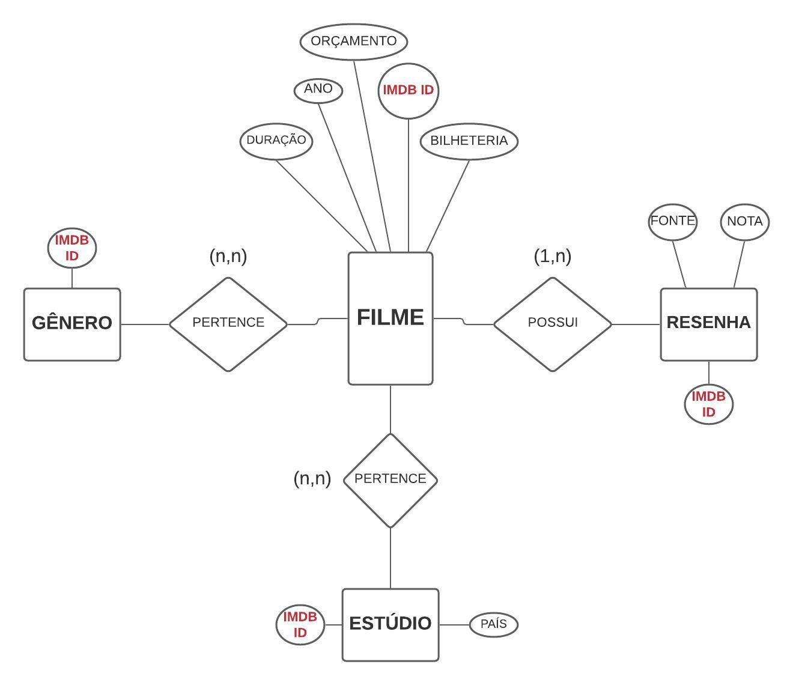

# Projeto SQLflix

# Equipe `Time BDV` - `BDV`
* `Daniel Credico de Coimbra` - `155077`
* `Gabriel Bonfim Silva de Moraes` - `216111`
* `Victor Durço Gomes Bijos` - `206508`

## Resumo do Projeto
Dataset que integra informações de diversas fontes sobre os 25 filmes com maior bilheteria de cada um dos últimos 70 anos, totalizando 1750 filmes. Cada filme está relacionado a gêneros e estúdios, além de ser informado características como ano, avaliação crítica (IMDb e Metacritic), bilhetaria, número de bilhetes vendidos, e código IMDb. O objetivo é permitir maior compreensão do fenômeno cultural do cinema e melhor tomada de decisões sobre produção de filmes.

## Slides da Apresentação
[Link da apresentação (Google Slides)](https://docs.google.com/presentation/d/1Vr6LKrjrr8X0oHr7gW7Hakeil23GS08EE2XSjtrjvOk/)

## Modelo Conceitual Preliminar

## Modelos Lógicos Preliminares
### Modelo relacional: quatro tabelas
~~~
FILMES: (imdb_id, título, ano, bilheteria, número_ingressos_vendidos)
RESENHA-FILME: (imdb_id, fonte, nota)
ESTÚDIO-FILME: (imdb_id, estúdio, país)
GÊNERO-FILME: (imdb_id, gênero)
~~~

### Modelo hierárquico: coleção de objetos "filme"
~~~
{
  imdb_id,
  título,
  ano,
  bilheteria,
  número_ingressos_vendidos,
  resenhas: {
    fonte,
    nota
  },
  estúdios: {
    estúdio,
    país
  },
  gêneros: {
    nome_gênero
  }
}
~~~

### Modelo de grafo
~~~
Nódulo: filme (imdb_id: int, título: str, ano: int, bilheteria: int, número_ingressos_vendidos: int)
Nódulo: resenha (fonte: str, nota: float).
Nódulo: estúdio (nome: str, país: str).
Nódulo: gênero (nome: str).
Relação: possui (resenha × filme).
Relação: pertence (estúdio × filme).
Relação: pertence (gênero × filme).
~~~

##### Falta um modelo lógico!!

## Dataset Preliminar a ser Publicado
título do arquivo/base | link | breve descrição
----- | ----- | -----
`SQLflix_parcial.PNG` | [SQLflix parcial](data/processed/SQLflix_parcial.PNG) | `Tabela única contendo uma linha por cada filme no nosso recorte, informando: código IMDb, título, ano, bilheteria, número de ingressos vendidos, avaliação IMDb, avaliação Metacritic, e seus gêneros.`

## Bases de Dados

título da base | link | breve descrição
----- | ----- | -----
`The Movie Database` | `https://www.themoviedb.org/ (API)` | `O Movie Database (TMDB) é um banco de dados popular e editável pelo usuário para filmes e programas de TV.`
`IMDB Database` | `https://www.imdb.com/ (API)` | `API oficial do IMDB (com grandes restrições de uso)`
`Metacritic (site)` | `https://www.metacritic.com/ (Web scraping)` | `Popular site para reviews de jogos, filmes e séries`
`The Numbers (site)` | `https://www.the-numbers.com/ (Web scraping)` | `Site com  útil serviço de dados financeiros sobre filmes.`

## Operações realizadas para a construção do dataset

> Coloque um link para o arquivo do notebook, programas ou workflows que executam as operações de construção do dataset:
* extração de dados de fontes não estruturadas como, por exemplo, páginas Web
* agregação de dados fragmentados obtidos a partir de API
* integração de dados de múltiplas fontes
* tratamento de dados
* transformação de dados para facilitar análise e pesquisa

> Se for notebook, ele estará dentro da pasta `notebook`. Se por alguma razão o código não for executável no Jupyter, coloque na pasta `src`. Se as operações envolverem queries executadas atraves de uma interface de um SGBD não executável no Jupyter, como o Cypher, apresente na forma de markdown.

## Perguntas de Pesquisa/Análise Combinadas e Respectivas Análises

> Liste aqui as perguntas de pesquisa/análise e respectivas análises.
> Nem todas as perguntas precisam de queries que as implementam.
> É possível haver perguntas em que a solução é apenas descrita para
> demonstrar o potencial da base.
>
### Pergunta/Análise 1
> * Pergunta 1

### Pergunta/Análise 2
> * Pergunta 2

### Pergunta/Análise 3
> * Pergunta 3

